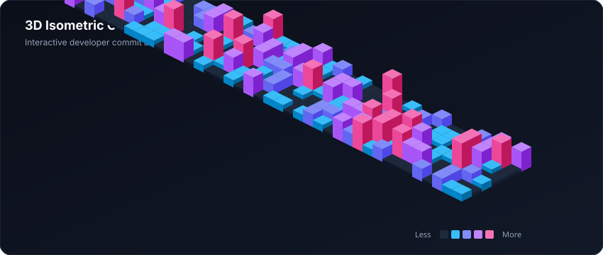

<!-- 3D WAVING DYNAMIC HEADER -->

<!-- 3D TYPEWRITER ANIMATION -->

 

<!-- BADGES -->

  

> ⚡ *Bridging deep learning architectures and data-driven business intelligence to build intelligent, production-ready systems.*

---

### 🏆 3D GitHub Achievements & Trophies

  

---

### 🧊 3D Contribution Visualizer

  
  
<em>(Automated daily 3D isometric contribution block city powered by GitHub Actions)</em>

---

### 🚀 Flagship Deployments & Production Systems

<table>
  <thead>
    <tr align="left">
      <th width="35%">System & Architecture</th>
      <th width="20%">Track</th>
      <th width="30%">Core Tech Stack</th>
      <th width="15%">Links</th>
    </tr>
  </thead>
  <tbody>
    <tr>
      <td>
        <strong>QIBoneNet</strong> 
        Quantum-Inspired Deep Learning system for automated bone cancer detection from histopathology images (IEEE Submission).
      </td>
      <td><code>AI / ML Engineering</code></td>
      <td><code>PyTorch</code> <code>DenseNet-121</code> <code>QIA</code> <code>Grad-CAM</code></td>
      <td><a href="https://github.com/kidi-un/Qi-bonenet"><strong>Code</strong></a></td>
    </tr>
    <tr>
      <td>
        <strong>Customer Churn Predictor</strong> 
        End-to-end predictive classifier with SHAP explainability, retention recommendations, and batch CSV scoring.
      </td>
      <td><code>Machine Learning</code></td>
      <td><code>Scikit-Learn</code> <code>Random Forest</code> <code>Streamlit</code></td>
      <td>
        <a href="https://vasanth-churn.streamlit.app"><strong>Live Demo</strong></a> 
        <a href="https://github.com/kidi-un/churn_predictor">Code</a>
      </td>
    </tr>
    <tr>
      <td>
        <strong>E-commerce Sales Intelligence</strong> 
        Interactive executive dashboard analyzing 99,000+ orders across customer geography, revenue, and delivery quality.
      </td>
      <td><code>Data Analytics & BI</code></td>
      <td><code>Pandas</code> <code>Plotly Express</code> <code>Streamlit</code></td>
      <td>
        <a href="https://vasanth-ecommerce.streamlit.app"><strong>Live Demo</strong></a> 
        <a href="https://github.com/kidi-un/ecommerce_dashboard">Code</a>
      </td>
    </tr>
    <tr>
      <td>
        <strong>HR Workforce Attrition</strong> 
        Exploratory analysis and predictive modeling uncovering root causes of employee attrition and retention levers.
      </td>
      <td><code>Diagnostic Analytics</code></td>
      <td><code>Python</code> <code>Seaborn</code> <code>Feature Eng</code></td>
      <td><a href="https://github.com/kidi-un/hr_attrition"><strong>Code</strong></a></td>
    </tr>
  </tbody>
</table>

---

### 💻 3D Tech Stack & Tooling

  
<strong>Languages, Frameworks, Machine Learning & Analytics</strong>

  

 

<table>
  <tr>
    <td width="30%"><strong>Data Analytics & BI</strong></td>
    <td>
      
      
      
      
      
      
    </td>
  </tr>
  <tr>
    <td width="30%"><strong>AI & Deep Learning</strong></td>
    <td>
      
      
      
      
      
    </td>
  </tr>
</table>

---

### 📊 Performance & Consistency Metrics

  
  

---

### 📬 Connect With Me
* 💼 **LinkedIn:** [linkedin.com/in/vasanth-arul](https://www.linkedin.com/in/vasanth-arul)
* 🌐 **Interactive Portfolio:** [kidi-un.github.io/portfolio](https://kidi-un.github.io/portfolio/)
* 📧 **Direct Email:** [vasanthprofjob@gmail.com](mailto:vasanthprofjob@gmail.com)

  

